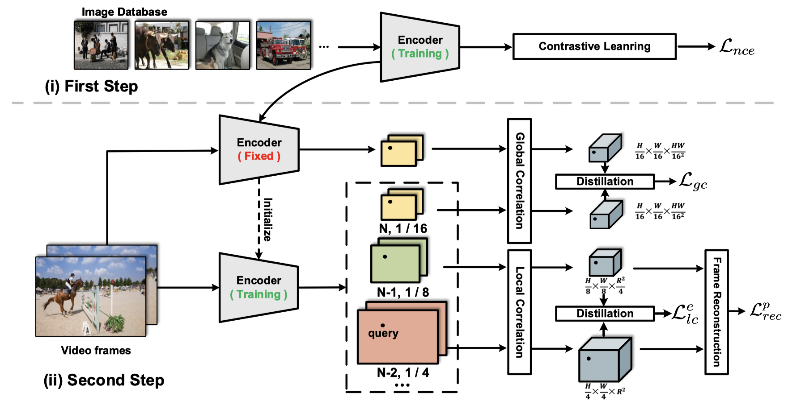

## [CVPR 2023] Spatial-then-Temporal Self-Supervised Learning for Video Correspondence

### Introduction

This is the official code for  "**Spatial-then-Temporal Self-Supervised Learning for Video Correspondence**" (CVPR'23).

<!--  -->

    
 

Under progress ...